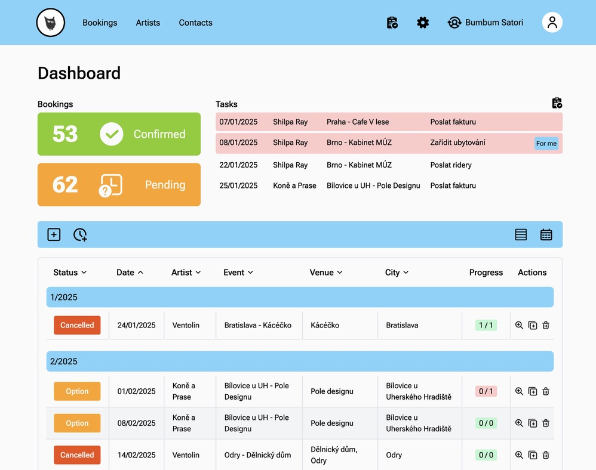
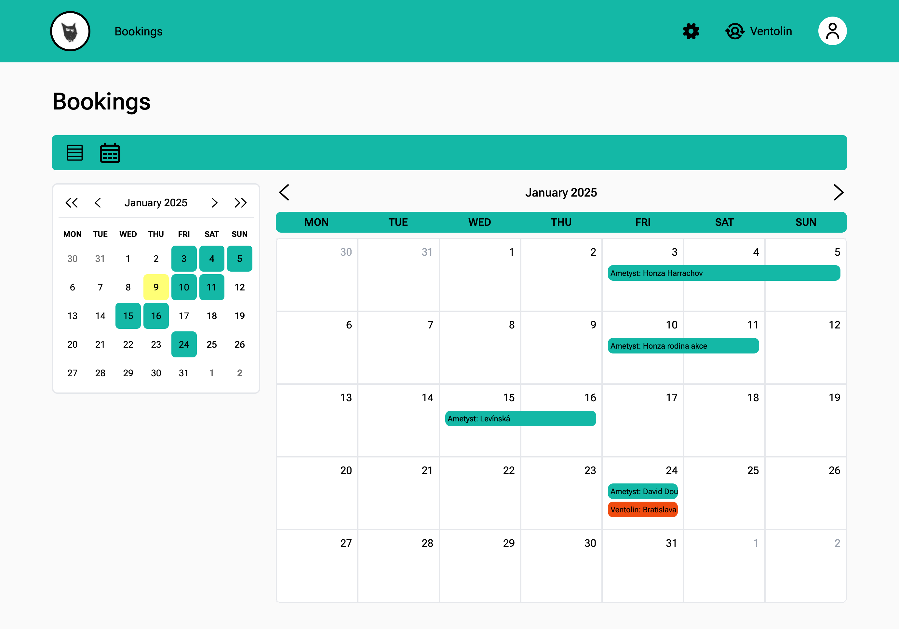
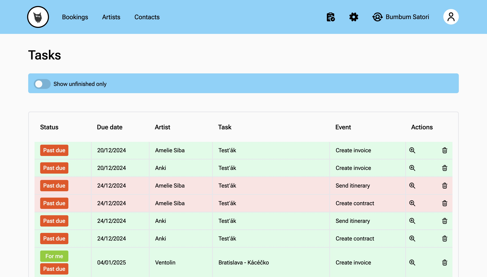
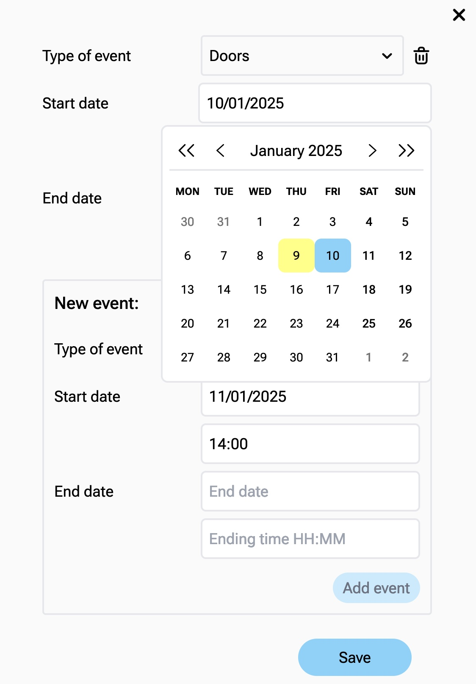
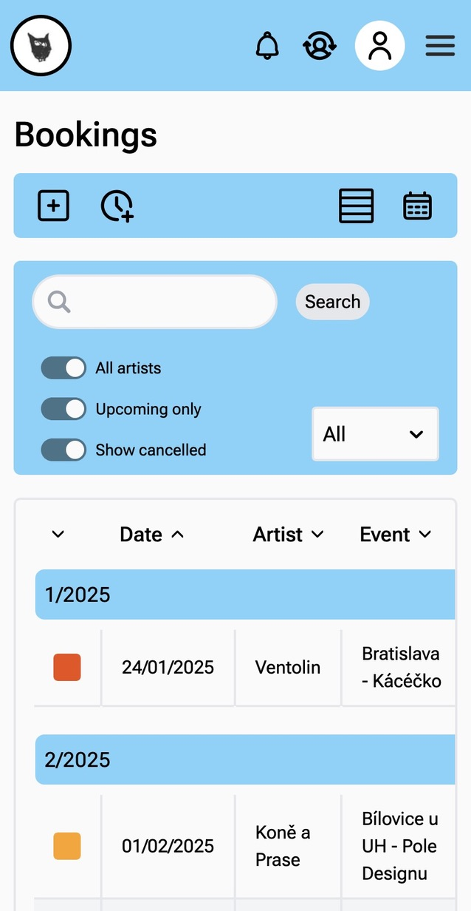
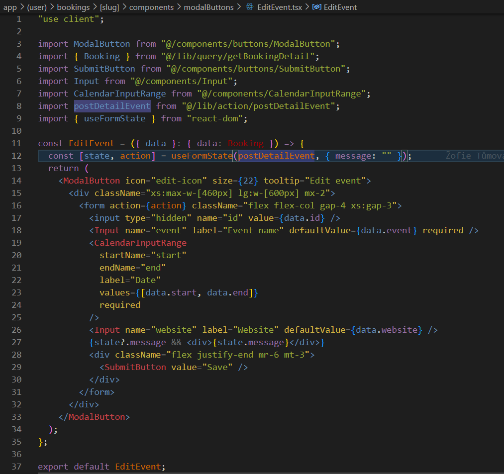
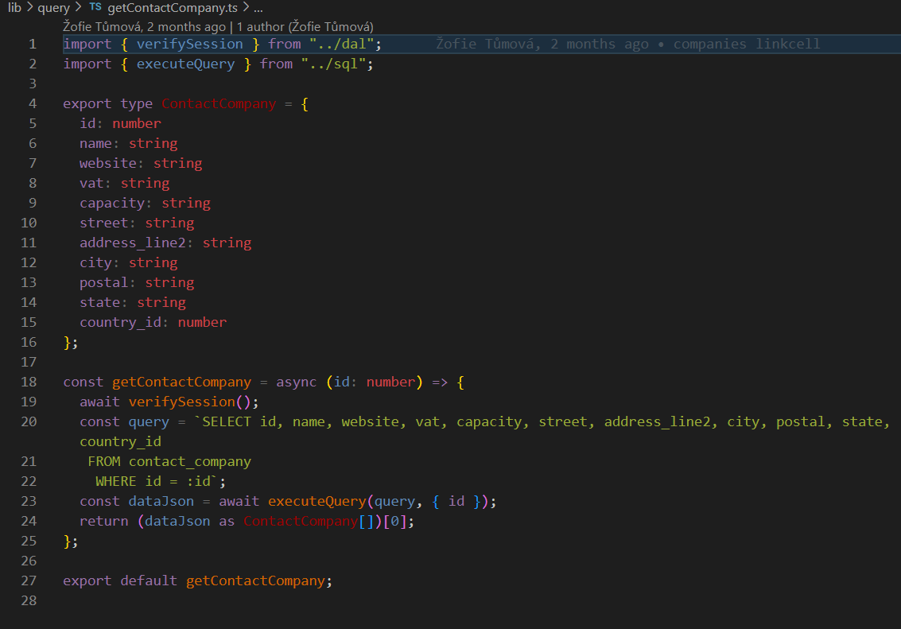
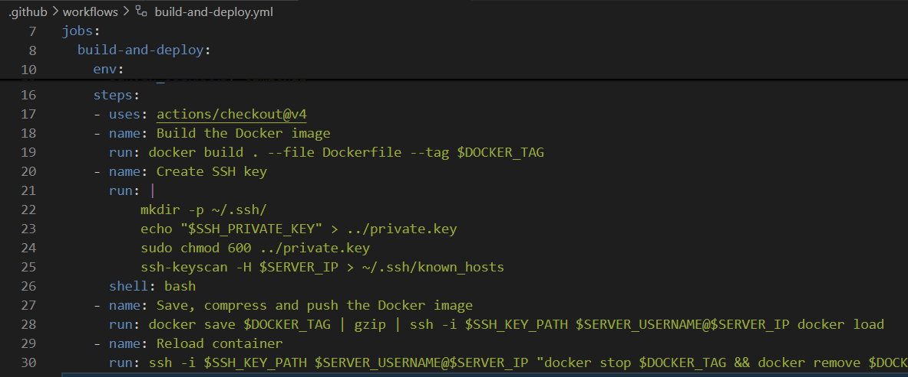

# Bumbum Satori: o projektu

Bumbum Satori je intranetové řešení na míru pro hudební bookingovou agenturu, které slouží jako systém pro agenty i zastupované umělce. Agentům nabízí správu událostí, profilů umělců a komunikaci s umělci, umělcům přehled koncertů a výdělků z nich. Systém je napsaný načisto podle původní PHP aplikace s převedenou původní databází. Na zakázku Bumbum Satori vytvořila [@caroluxurians](https://github.com/caroluxurians) s mentoringem [@timichal](https://github.com/timichal).

## Obsah

- [Stack](#stack)
- [Klíčové funkce](#klíčové-funkce)
  - [Rozhraní podle role](#rozhraní-podle-role)
  - [Správa kalendáře](#správa-kalendáře)
  - [Zadávání úkolů a notifikace](#zadávání-úkolů-a-notifikace)
  - [Nativní formuláře](#nativní-formuláře)
  - [Responzivní design](#responzivní-design)
- [Ukázky kódu](#ukázky-kódu)

## Stack

- Frontend je napsaný v [Reactu](https://react.dev) a [Next.js 14](https://nextjs.org) s použitím [app routeru](https://nextjs.org/docs/app).
- Na stylování je použitý [Tailwind CSS](https://tailwindcss.com).
- Backend je řešený přímo v Next.js aplikaci pomocí [server actions](https://nextjs.org/docs/app/building-your-application/data-fetching/server-actions-and-mutations) a knihovny [mysql2](https://www.npmjs.com/package/mysql2).
- Všechny komponenty a backendové funkce jsou otypované v [TypeScriptu](https://www.typescriptlang.org).
- MySQL databáze je převzata z původní PHP aplikace a upravená pro novou aplikaci a MySQL 9.
- Aplikace i databáze běží v [Dockeru](https://www.docker.com) na virtualním serveru v [Hetzner Cloud](https://www.hetzner.com/cloud), deploy je automatizovaný pomocí [GitHub Actions](https://github.com/features/actions).

## Klíčové funkce

### Rozhraní podle role

Primárními uživateli jsou agenti z Bumbum Satori. Ti mají přidělené jednotlivé umělce a mají přístup ke správě jejich profilů, událostí a úkolů. Hlavní agent má roli administrátora s přístupem ke všem umělcům a také ke správě agentů.

Do systému mají přístup i samotní umělci a členové jejich týmu. Ti vidí organizační detaily jednotlivých událostí a jejich vyúčtování.

### Správa kalendáře

Události a blokované termíny je možné zobrazit a upravovat i v kalendářovém rozvržení. Malý přehledový kalendář je postavený na [react-calendar](https://www.npmjs.com/package/react-calendar), velký s rozpisy událostí je custom.

### Zadávání úkolů a notifikace

Agenti mohou sobě i ostatním přidělovat úkoly. Ty se zobrazují na dashboardu, upozornění na blížící se termíny je navíc možné zasílat e-mailem.

### Nativní formuláře

Aplikace se snaží co nejvíce využívat funkcionalitu Reactu a Next.js bez nadbytečných knihoven. Kde je to možné, používá aplikace nativní HTML formuláře, které jsou napojené na server actions přes [useActionState](https://react.dev/reference/react/useActionState) hook přímo z Reactu. Inputy pro datum využívají jednoduchý react-calendar. Validace formulářů se řeší přímo v server actions.

### Responzivní design

Zejména umělci využívají aplikace především na mobilech, aplikace je tedy optimalizovaná pro všechny šířky displejů.

## Ukázky kódu

### Formulář

Formuláře jsou postavené na reactím hooku useActionState (dříve useFormState) a jednoduchých vlastních komponentách pro inputy a tlačítka.

### Backend v next.js

Data z databáze se posílají i ukládájí pomocí serverových funkcí v Nextu, které využívají knihovnu mysql2 zajišťující mj. sanitizaci dat. U každé akce se před provedením ověřuje oprávnění uživatele ji provést a příchozí data se rovnou typují.

### Automatizovaný deployment

Každý push do příslušné branche vyvolá jednoduchou server action na GitHubu. V jejím rámci se automaticky zbuilduje docker image s aplikací a přes SSH se přenese a spustí na serveru běžícím na Hetzner Cloud.

